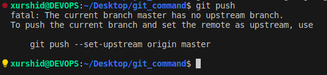

### GIT


1. git init qilamiz

```
git init
```


---

---

2. git add . 

```
git add .
```


---

---

3. git commit -m "git"

```
git commit -m "git"
```


---

---

4. git remote add origin git@github.com:sotiboldiyevxurshid/git_command.git

```
git remote add origin git@github.com:sotiboldiyevxurshid/git_command.git
```


---


---

5. git push

```
git push
```



---

---

6. git push --set-upstream origin master

```
git push --set-upstream origin master
```


dbjdfnbfj


